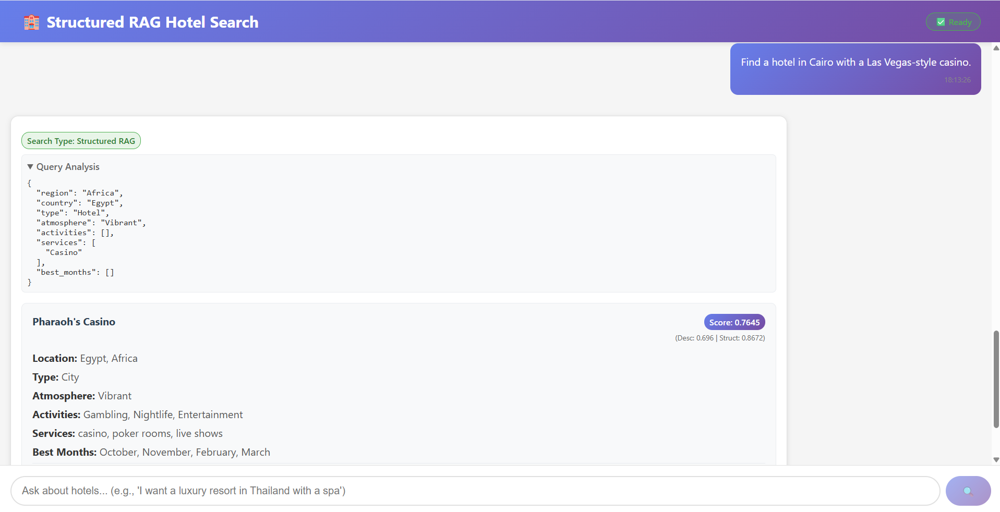

# Structured RAG Hotel Search (Chatbot)

This app helps you find hotels using AI and advanced search. It uses FastAPI, React, OpenAI, and Qdrant (a vector database) to give you smart, relevant hotel recommendations.



## How It Works
- You ask about hotels (e.g., "I want a luxury hotel in Spain with a spa").
- The backend analyzes your query, extracts what you want (location, type, amenities, etc.), and searches hotels stored in Qdrant.
- Results are ranked using both semantic meaning and structured filters.
- The frontend shows you the best matches and details for each hotel.

## Main Tech
- **Backend:** FastAPI (Python), Qdrant (vector DB), OpenAI (GPT-4o for query analysis and embeddings)
- **Frontend:** React (TypeScript)

## Setup

### Prerequisites
- Python 3.8+
- Node.js 16+
- OpenAI API key
- Qdrant Cloud account (or local Qdrant server)

### Backend
1. Go to the `backend` folder:
   ```bash
   cd backend
   ```
2. Create and activate a virtual environment:
   ```bash
   python -m venv venv
   # Windows:
   venv\Scripts\activate
   # Mac/Linux:
   source venv/bin/activate
   ```
3. Install dependencies:
   ```bash
   pip install -r requirements.txt
   ```
4. Copy `.env.example` to `.env` and fill in your Qdrant and OpenAI keys:
   ```bash
   cp .env.example .env
   # Edit .env and add QDRANT_URL, QDRANT_API_KEY, OPENAI_API_KEY
   ```
5. Start the backend:
   ```bash
   python main.py
   ```
   The API runs at `http://localhost:8001`

### Frontend
1. Go to the `frontend` folder:
   ```bash
   cd frontend
   ```
2. Install dependencies:
   ```bash
   npm install
   ```
3. Start the frontend:
   ```bash
   npm start
   ```
   The app runs at `http://localhost:3000`

## Usage
- Open the app in your browser.
- Ask about hotels using natural language.
- See the best matches and details for each hotel.

## Customization
- To add or update hotels, use Qdrant (see backend code for details).
- To change query analysis, update the prompt in `main.py`.
- For UI tweaks, edit `frontend/src/App.tsx` and `App.css`.

## Troubleshooting
- If you see "Server not ready" or connection errors, check your `.env` file and make sure Qdrant and OpenAI keys are correct.
- Make sure Qdrant is running and accessible from your backend and that the collections that you created are accesible from your backend.


Made with ❤️ using FastAPI, React, Qdrant, and OpenAI.
